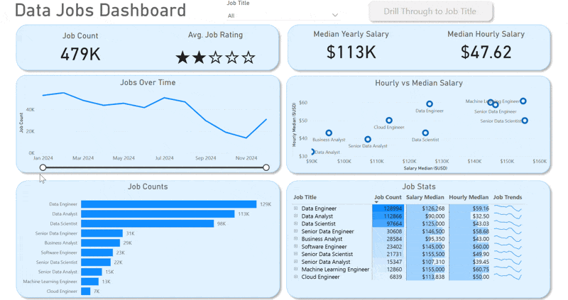

# 💼 Data Jobs Dashboard – Power BI for Data Analytics & Career Insights

## 📘 Project Summary

The **Data Jobs Dashboard** was developed as a data storytelling and exploration tool aimed at **job seekers, data analysts, and ML professionals** looking to understand hiring trends in the tech industry. Using a real dataset of 2024 data science job listings, the dashboard consolidates fragmented job market data into a unified, analytical report—offering insight into job titles, compensation, work location types, and more.

Built entirely in **Power BI**, this project mimics the responsibilities of a data analyst and highlights how data visualization can support decision-making and strategic planning.

### 📁 Access the Dashboard

Download and explore the complete Power BI project file here: [`Data_Jobs_Dashboard.pbix`](Data_Jobs_Dashboard.pbix)

---

## 🛠️ Skills Aligned with Data Analytics & ML Roles

This project demonstrates essential skills commonly required in **data analyst** and **machine learning engineer** roles:

- **⚙️ Data Cleaning & Feature Engineering (Power Query)**  
  - Performed structured preprocessing  
  - Handled missing data, transformed data types  
  - Engineered new columns for categorical breakdowns

- **🧮 Analytical Metric Design using DAX**  
  - Created performance indicators such as `Median Salary`, `Job Count`, and `Remote Ratio`  
  - Simulated feature extraction logic commonly used in ML pipelines

- **📊 Exploratory Data Analysis (EDA) via Visualization**  
  - Used **Bar, Line, Area,** and **Column charts** to identify trends, outliers, and seasonal patterns  
  - Segmented job data by role, location, and salary for interpretability

- **🗺️ Spatial and Temporal Analysis**  
  - Incorporated **map visuals** for global trend analysis  
  - Analyzed job distributions across cities, countries, and remote-first employers

- **📈 KPI Reporting & Tabular Summaries**  
  - Designed interactive KPI cards and **sortable tables** to facilitate stakeholder-style reporting  
  - Simulated reporting dashboards used in BI tools like Tableau and Power BI

- **🎨 UX/UI for Business Storytelling**  
  - Applied data storytelling principles using clean layouts, thematic visuals, and intuitive navigation  
  - Balanced high-level and drill-down views for decision makers

- **🖱️ Interactive Features & User-Driven Filtering**  
  - Implemented **slicers, bookmarks, and drill-through filters** to enhance user control  
  - Emulated real-world dashboard interactivity for dynamic exploration and model validation

---

## 📊 Dashboard Breakdown

The report is split into two pages to support both **strategic overview** and **targeted drill-downs**, similar to business intelligence workflows:

### 🧭 Page 1: Job Market Overview

Get a quick snapshot of job availability, median salaries, and top roles across industries and locations. This high-level view supports executive-level trend analysis.

### 🔍 Page 2: Job Role Deep Dive

Use drill-through filters to focus on specific job titles and explore related insights: salary bands, work type (remote/on-site), hiring platforms, and regional patterns.

---

## ✅ Key Takeaways

This Power BI dashboard simulates a real-world analytical workflow—from **data ingestion and transformation** to **interactive storytelling**—mirroring the cross-functional role of a **data analyst** and offering a foundation for **ML feature analysis and trend interpretation**. It enables actionable insight generation that’s crucial in both business decision-making and model context building.

---

📺 **Special Thanks:**  
Grateful for the excellent guidance from [How to Power BI](https://www.youtube.com/watch?v=FwjaHCVNBWA), whose tutorial made this project possible.
